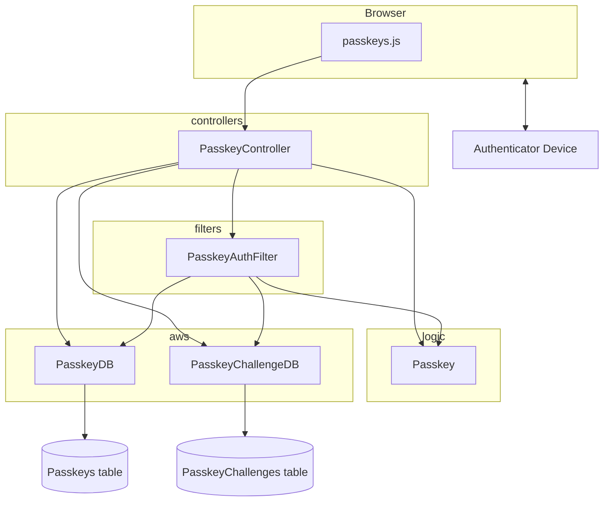

# Passkeys Integration

Passkeys are being used for additional authentication to access sensitive resources 
such as AWS credentials and AWS consoles.  
This doc describes the points of integration and where to find the most important code.

The serverside verification of passkeys is being done by the [webauthn4j](https://github.com/webauthn4j/webauthn4j) 
library.
The [documentation for that library](https://webauthn4j.github.io/webauthn4j/en/) is excellent and gives a good 
background to the integration.

## Terminology

### Authenticator
The device that generates a cryptographic key pair and stores the private key.
This could be a hardware device like a Yubikey or it could be software like Android password manager.  
The user chooses this at registration time.  We allow any authenticators that are available to the browser.

### Relying Party (RP)
The web service or app that has an endpoint to protect.  We would say that Janus is the RP in this scenario.

## Key files

The integration is encapsulated in the following files:

### [frontend/utils/passkeys.js](/frontend/utils/passkeys.js)
Authentication takes place in the browser and the functions in this file control interactions between the server and
the authenticator.

### [models/Passkey](/app/models/Passkey.scala)
All the passkey-specific models passed between views and the database are defined here.
Also model <-> Json marshalling rules.

### [controllers/PasskeyController](/app/controllers/PasskeyController.scala)
This holds actions for registration of passkeys and for providing registration and authentication options to browsers
at the beginning of registration and authentication flows respectively. 

### [filters/PasskeyAuthFilter](/app/filters/PasskeyAuthFilter.scala)
A filter for actions that are protected by passkey authentication.

### [logic/Passkey](/app/logic/Passkey.scala)
A wrapper around the WebAuthn4j library methods to make them usable in controllers.  

### [aws/PasskeyDB](/app/aws/PasskeyDB.scala)
Controls all interactions with the [Passkeys](#passkeys) Dynamo DB table.

### [aws/PasskeyChallengeDB](/app/aws/PasskeyChallengeDB.scala)
Controls all interactions with the [PasskeyChallenges](#passkeychallenges) Dynamo DB table.

## Dynamo tables
Two Dynamo tables are used to hold passkeys data.

### Passkeys
Each item is a passkey public key and various pieces of metadata about the passkey.
It's keyed by user ID and credential ID.

### PasskeyChallenges
Each item is a transient challenge keyed by user ID.
The TTL attribute gives the expiry time for the challenge.
Once used, the challenges are removed from the table.

## Variations in browser implementations
The browsers that have been tested all have slightly different behaviours with passkeys.

### Chrome
Chrome's default option is to use its own built-in passkey authenticator.  
This is stored on the device where the browser is running so isn't synced across devices. 
On a Mac, it will fall back to the iCloud Keychain authenticator if the user chooses. 

### Firefox
Firefox uses the native OS mechanism to find a default authenticator which on a Mac is the iCloud Keychain.
This means that without an Apple account there is no on-device authenticator for Firefox.
Depending on how it's configured, an on-device password manager could be used instead.  

### Safari
Safari, as might be expected, uses the iCloud Keychain as its default authenticator.
So behaviour is similar to Firefox.
